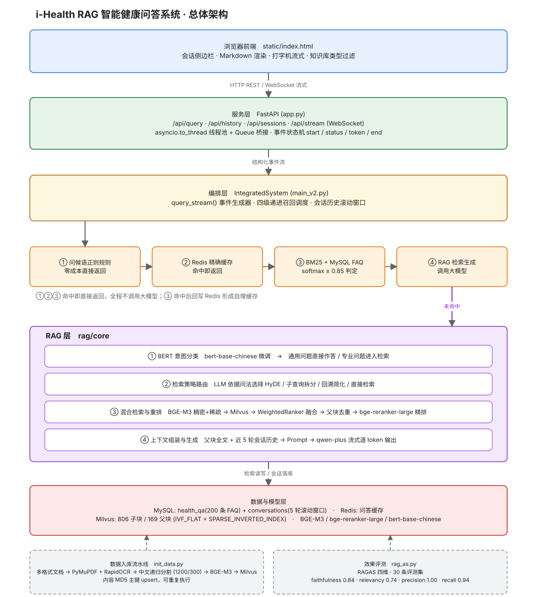

# i-Health RAG 智能健康问答系统

面向饮食营养 / 体重管理 / 作息睡眠 / 运动健身 / 亚健康 / 心理健康六大场景的
垂直领域智能问答系统。

## 核心特性
- 四级递进召回：问候语规则 → Redis → BM25 标准问答库 → RAG 生成
- BERT 意图分流：通用问题跳过检索直答
- 检索链路可配置：BGE-M3 稠密单路 / 稠密+稀疏混合 + WeightedRanker 融合 / 叠加 bge-reranker-large 精排
- 父子分块：子块检索保证命中精度，回溯父块保证上下文完整
- Query 改写策略路由：HyDE / 子查询 / 回溯简化 / 直接检索
- 真流式输出：WebSocket 逐 token 下发 + 阶段进度提示
- 多格式文档入库：PDF / DOCX / PPT / 图片，OCR 自动降级

## 评测结果

**实时链路实测**（30 条评测集：真实检索 + 真实生成，RAGAS 四维）：

| 指标 | 分数 |
| --- | --- |
| faithfulness | 0.62 |
| answer_relevancy | 0.88 |
| context_precision | 0.85 |
| context_recall | 0.85 |

> 口径说明：上表由 [`rag_ablation.py`](rag_ablation.py) 走**实时链路**测出（检索 + 生成均真实执行），
> 对应默认配置（稠密检索 / K=20 / M=2）。
> [`rag_as.py`](rag/rag_assessment/rag_as.py) 则评测一份**固化快照**（`rag_evaluate_data.json`），
> 用于可复现的历史对比，两者口径不同、不可混用。
> 另注：30 条评测集规模偏小，指标差异需结合置信区间解读。

### 检索策略消融实验

用同一套 30 题、同一 Prompt、同一模型（temperature=0）对比三种检索方式与两种召回池宽度：

| 配置 | faithfulness | answer_relevancy | context_precision | context_recall | 检索 P50 |
| --- | --- | --- | --- | --- | --- |
| 稠密单路 K=3 | **0.655** | 0.874 | **0.867** | 0.820 | 0.5s |
| **稠密单路 K=20（当前默认）** | 0.623 | **0.884** | 0.850 | **0.854** | **0.6s** |
| 混合 K=3 | 0.542 | 0.853 | 0.817 | 0.731 | 0.5s |
| 混合 + 重排 K=3 | 0.570 | 0.867 | 0.800 | 0.787 | 5.8s |
| 混合 + 重排 K=20 | 0.617 | 0.880 | 0.850 | 0.806 | 26.6s |

**结论（数据驱动地调整了默认配置）**：

先看 `K=3` 下的逐层叠加，就能定位分差的真正来源：

| K=3 逐步叠加 | faithfulness | 变化 |
| --- | --- | --- |
| 稠密单路 | 0.655 | 基线 |
| ＋ 稀疏向量融合（混合） | 0.542 | **−0.113** |
| ＋ 交叉编码器重排 | 0.570 | **＋0.028** |

1. **拖低 faithfulness 的是「稀疏向量融合」，不是重排** —— 重排在 `K=3` 时反而是 **+0.028 的正收益**。
   根因是 `WeightedRanker(0.7, 1.0)` 给**稀疏分支的权重（1.0）高于稠密分支（0.7）**，
   而中文健康问句的词面匹配噪声更大，把语义更正确的块挤出了候选。
2. 将召回池扩到 `K=20` 后各指标回升（precision 0.800 → 0.850、faithfulness 0.570 → 0.617）。
3. 但在**同一池宽**下，稠密单路仍全面不劣于混合+重排，而重排使检索 P50 从
   **0.6s 升到 26.6s（约 45 倍）**。
4. 因此默认配置改为 **稠密单路 + K=20**；重排链路完整保留，可通过
   `config.ini` 的 `retrieval_mode = full` 一键切回。

原始实验数据见 [`rag/rag_assessment/ablation_cache/`](rag/rag_assessment/ablation_cache/)，
可配 `python rag_ablation.py --reuse` 在不重复检索/生成的前提下重跑评测。

> 边界说明：30 题评测集偏"直接事实型"，**未覆盖重排最擅长的场景**（专有名词消歧、多实体比较）；
> 且 0.006~0.048 的差异可能含噪声（观测过约 ±0.02 的跑间波动）。
> 因此结论应限定为"**在本项目评测集与当前权重配置下**，稠密单路不劣于混合+重排"，
> 而非"重排无用"。

### 四级召回命中率基准

[`bench_recall.py`](bench_recall.py) 在 **800 条查询**（200 条 FAQ 原题 + 600 条规则轻改写）上实测：

| 层 | 冷缓存 | 热缓存 | 延迟 P50 / P95 |
| --- | --- | --- | --- |
| ① 问候语规则 | 正则匹配，构造上 100% | — | ~0 |
| ② Redis 缓存 | 0 | **792 / 800（99.0%）** | **0.9ms / 1.4ms** |
| ③ BM25 + 标准问答库 | **792 / 800（99.0%）** | 0 | **3.4ms / 5.1ms** |
| ④ RAG 检索生成 | 8 / 800（1.0%） | 8 / 800（1.0%） | ~34s |

对标准问答库覆盖的问题，**拦截率 99.0%，且拦截即正确**（正确率同为 99.0%，零误匹配）。

阈值扫描（同时统计负样本假阳性率）：

| 阈值 | 原题拦截率 | 硬负假阳率 | 软负拦截率 |
| --- | --- | --- | --- |
| 0.70 | 100% | **0.0%** | 26.7% |
| **0.85（默认）** | 99.0% | **0.0%** | 16.7% |
| 0.95 | 97.0% | 0.0% | 6.7% |

- **硬负样本**（明显域外 + 健康域内短泛化）最高分仅 **0.367**，说明阈值只要 >0.40 就不会误拦域外问题。
- **软负样本**（领域内但开放的问题，取自评测集 30 题）在 0.85 阈值下仍有 **16.7% 被拦截**，
  其中 3 条为**错误匹配**（例如"膳食参考摄入量（DRIs）包括哪些指标？"以 0.898 分被答成
  "抑郁情绪和抑郁症有什么区别？"）。这暴露出**以 softmax 概率作置信度的结构性缺陷**：
  泛化疑问措辞（"包括哪些""有什么区别""分别"）在分词后与多条 FAQ 共享词元，产生虚高分数。
  改进方向是改用 Top1–Top2 分数间隔（margin）作判据，或先过滤疑问套话再计算 BM25。

> 口径说明：上述 99.0% 是"**标准问答库覆盖范围内**的拦截率"，不等于真实流量的命中率 ——
> 后者取决于用户提问落在 200 条 FAQ 覆盖范围内的比例，需线上数据才能统计。

## 架构图



> 上图源文件为 [`docs/architecture.drawio`](docs/architecture.drawio)，可用 [draw.io](https://app.diagrams.net) 打开编辑；
> 若所用 Markdown 阅读器不渲染 SVG，可直接查看 [`docs/architecture.png`](docs/architecture.png)。

## 环境依赖
MySQL 8.0 / Redis / Milvus 2.5 需本地启动

## 快速开始
1. `pip install -r requirements.txt`（推荐，仅安装直接依赖）
   如需与开发环境完全一致的版本：`pip install -r requirements-lock.txt`
2. `cp config.example.ini config.ini` 并填入 DashScope API Key
3. 下载模型（见下）
4. 初始化数据（建表 → 导入 FAQ → 文档向量入库）：
   ```bash
   python init_data.py            # 幂等初始化；已存在则跳过 FAQ 导入
   python init_data.py --force    # 强制重建（清空 FAQ 表 + 重建 Milvus 集合）
   python init_data.py --only mysql    # 只初始化问答库（不加载大模型，很快）
   ```
5. `python app.py` → http://localhost:8080

## 模型下载
本项目不包含模型权重（约 7.5GB），请自行下载到 `rag/models/`：
| 模型 | 用途 | 来源 |
| --- | --- | --- |
| BAAI/bge-m3 | 稠密+稀疏向量 | https://huggingface.co/BAAI/bge-m3 |
| BAAI/bge-reranker-large | 交叉编码器重排 | https://huggingface.co/BAAI/bge-reranker-large |
| google-bert/bert-base-chinese | 意图分类基座 | https://huggingface.co/google-bert/bert-base-chinese |
| damo/nlp_bert_document-segmentation-chinese-base | 文档语义分段（**可选**） | https://modelscope.cn/models/damo/nlp_bert_document-segmentation_chinese-base |

> 最后一项来自**魔搭 ModelScope**（阿里达摩院官方模型），仅在启用语义分段时才需要；
> 缺失时 `rag/text_splitter/__init__.py` 的条件导入会自动跳过，不影响主流程。

`bert_intent_recognizer`（意图分类权重）**首次运行会自动用
`rag/bert_train_data/` 下的 500 条语料训练并保存**，无需手动准备。

## 项目结构

```
i-Health_system/
├── app.py                          # ★ 服务入口: FastAPI HTTP 接口 + WebSocket 流式问答
├── init_data.py                    # ★ 数据初始化: 建表 -> 导入 FAQ -> 文档向量入库
├── main_v2.py                      # ★ 集成核心: 四级递进召回调度 + 会话历史管理
├── bench_recall.py                 # ★ 召回命中率基准: 分层拦截率 / 阈值扫描 / 负样本假阳性
├── rag_ablation.py                 # ★ 检索策略消融: 实时链路 (真检索+真生成) + RAGAS 评测
├── main.py                         #   早期命令行版入口 (保留作参照)
├── config.example.ini              #   配置模板 -> 复制为 config.ini 并填入 API Key
├── config.ini                      #   本地配置(含密钥) -> 已被 .gitignore 排除
├── requirements.txt                #   直接依赖 (33 个, 带分区注释)
├── requirements-lock.txt           #   完整锁定版 (222 个包, 含传递依赖)
├── LICENSE                         #   MIT 协议
├── .gitignore
│
├── docs/                           # 文档与配图
│   ├── architecture.drawio         #   架构图源文件 (用 draw.io 打开编辑)
│   ├── architecture.svg            #   架构图 (README 引用, 矢量)
│   └── architecture.png            #   架构图位图版 (备选)
│
├── base/                           # 基础设施
│   ├── config.py                   #   配置加载: config.ini + 环境变量覆盖
│   └── logger.py                   #   日志: 控制台 + 文件双通道, 10MB×5 轮转
│
├── mysql/                          # 结构化数据与缓存层
│   ├── database/mysql_client.py    #   FAQ 问答库读写 (health_qa 表)
│   ├── cache/redis_client.py       #   Redis 缓存读写
│   ├── retrieval/bm25_search.py    # ★ BM25 检索 + softmax 置信阈值(0.85) + 命中回写缓存
│   ├── utils/text_preprocess.py    #   jieba 中文分词
│   ├── main.py                     #   本层命令行入口, 可交互试查 FAQ 库
│   └── data/health_qa.csv          #   200 条精标 FAQ (8 类)
│
├── rag/                            # 检索增强生成层
│   ├── core/
│   │   ├── vector_store.py             # ★ Milvus 检索: 稠密/混合/混合+重排 三模式可配 + 父子去重
│   │   ├── rag_system_v2.py            # ★ 流式 RAG 主流程 (策略路由 + 阶段进度上报)
│   │   ├── search_strategy_selector.py #   LLM 检索策略路由 (HyDE/子查询/回溯/直接)
│   │   ├── intent_recognizer.py        # ★ BERT 通用-专业意图分类 (缺失权重时自动训练)
│   │   ├── document_preprocessor.py    #   多格式加载 + 父子分块
│   │   ├── llm_client.py               #   DashScope 同步 / 流式调用封装
│   │   ├── prompts.py                  #   Prompt 模板集中管理
│   │   └── rag_system.py               #   早期非流式版本 (保留作参照)
│   ├── document_loaders/           #   多格式文档加载器 (缺依赖时条件导入跳过)
│   │   ├── ocr.py                  #     RapidOCR 封装 (Paddle GPU / ONNX CPU 双引擎降级)
│   │   ├── pdf_loader.py            #     PDF: PyMuPDF 抽文本 + 图片 OCR + 页面旋转校正
│   │   ├── docx_loader.py            #     DOCX 解析
│   │   ├── ppt_loader.py            #     PPT / PPTX 解析
│   │   └── image_loader.py            #     图片 OCR
│   ├── text_splitter/               #   中文文本切分
│   │   ├── chinese_recursive_splitter.py  # ★ 中文递归分割器 (标点分隔优先级)
│   │   └── semantic_splitter.py   #     基于 modelscope 的语义分段 (可选依赖)
│   ├── rag_assessment/
│   │   ├── rag_as.py                   #   RAGAS 四维评测 (固化快照口径, Ollama / DashScope 双后端)
│   │   ├── rag_evaluate_data.json      #   30 条评测集 (question / context / answer / ground_truth)
│   │   └── ablation_cache/             #   ★ 消融实验原始数据 (5 组配置 + 汇总 JSON)
│   ├── bert_train_data/
│   │   └── bert专业通用问题分类500条.json  # 意图分类训练语料
│   ├── main.py                         # ★ 双模式入口: --data-processing 文档入库 / 命令行问答
│   ├── data/                           # 知识库源文档 (6 个领域 / 24 篇 PDF)
│   │   ├── 营养学_data/       (15 篇)
│   │   ├── 体重管理_data/      (3 篇)
│   │   ├── 运动健身_data/      (3 篇)
│   │   ├── 亚健康_data/        (1 篇)
│   │   ├── 作息睡眠_data/      (1 篇)
│   │   └── 心理健康_data/      (1 篇)
│   └── models/                     #   模型权重(约 7.5GB) -> 已被 .gitignore 排除, 需自行下载
│
├── static/
│   └── index.html                  # 前端单页: Markdown 渲染 / 会话侧边栏 / 流式打字机
│
└── logs/                           #   运行日志 -> 已被 .gitignore 排除
```

> 说明: 上表省略各 Python 包内的常规 `__init__.py`；`rag/data/` 下文件名未逐一展开。
> 标 ★ 的文件为主要实现所在，建议从这几处开始阅读。

## License

本项目代码采用 [MIT 协议](LICENSE)，Copyright (c) 2026 张志豪。

> 注：`rag/data/` 下的知识库文档均为公开出版/发布的科普与教学资料，此处仅为技术演示用途收录，
> 版权归原作者所有；`rag/models/` 下的模型权重未随仓库分发，请按上文"模型下载"自行获取。
> 以上第三方资源均**不在本 MIT 协议覆盖范围内**。